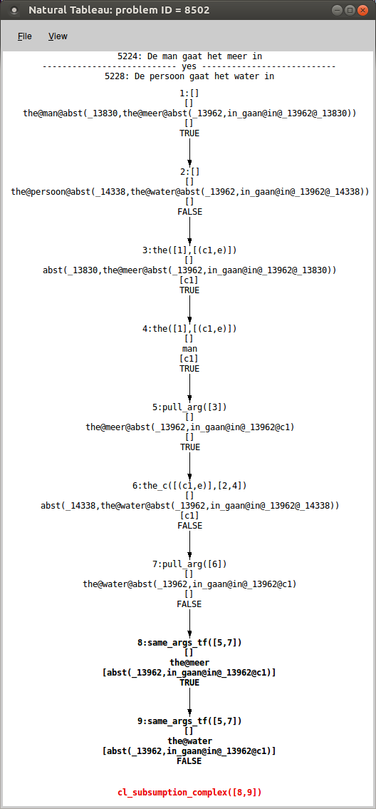

# prove_SICK_NL
Prove Ducth NLI problems of [SICK-NL](https://github.com/gijswijnholds/sick_nl) with [LangPro](https://github.com/kovvalsky/LangPro).
Note that the current repo contains SICK-NL version that corresponds its English counterpart used for [Semeval-2014 Task 1](https://alt.qcri.org/semeval2014/task1/). SemeEval version contains in total 9927 problems while the original one 9840 problems.

# Prerequisites

The current repo and the [LangPro](https://github.com/kovvalsky/LangPro) repo shoudl be in the same directory.

Get Langpro repo with
`git clone --branch nl git@github.com:kovvalsky/LangPro.git` or `git clone --branch nl https://github.com/kovvalsky/LangPro.git`.
It is used for theorem-proving and converting type-logical terms into simply-typed terms.
⚠️ It is important to select `nl` branch.
Additionally add `--single-branch` if you want to clone only `nl` branch.


`produce.ini` contains rules how to generate files.
You will need to install [produce](https://github.com/texttheater/produce) if you want to use the rules to build files from scratch.

# HowTo

## Theorem proving SICK-NL problems

Before proving the problems, either enter the prolog interactive mode (recommended for a demo usage):

```prolog
% loading the prover with alpino (or npn_robbert) trees
$ swipl -f prolog/main.pl  SICK_NL/sen.pl  SICK_NL/parses/alpino.pl  WNProlog/wn.pl
% This can be run only in the beginning, to set the global parameters: the part of the dataset, language flag, lexical annotation file, and theorem proving parameters
?- parList([parts([train]), lang(nl), anno_json('SICK_NL/anno/alpino.json'), complete_tree, allInt, aall, wn_ant, wn_sim, wn_der, constchck]).
```

Or run the prolog goals directly from the terminal:

```bash
$ swipl -g "PROLOG_PREDICATES_TO_BE_CHECKED" -t halt -f prolog/main.pl  SICK_NL/sen.pl  SICK_NL/parses/alpino.pl  WNProlog/wn.pl
```

### Prove a particular problem without abductive training

```prolog
% In an interactive mode, prove a problem and pretty display the proof in a separate window
% Run LangPro in the graphical mode with aligned terms (if the prove is found, it is most probably done with aligned terms as this mode is tested first for efficiency reasons.)
?- gentail(aligned, 8502).
Tableau for "yes" checking is generated with Ter,6 ruleapps
XP: [isa(man,persoon),isa(meer,water)]
true.
```

An image of the proof: 

```bash
# The same but with a terminal command:
$ swipl -g "parList([parts([train]), lang(nl), anno_json('SICK_NL/anno/alpino.json'), complete_tree, allInt, aall, wn_ant, wn_sim, wn_der, constchck]), gentail(aligned, 8502)." -f prolog/main.pl  SICK_NL/sen.pl  SICK_NL/parses/alpino.pl  WNProlog/wn.pl
```

Check [LangPro](https://github.com/kovvalsky/LangPro) repo for running the prover for entire data split.


## Generate typed terms in LaTeX/PDF
### For all sentences filtered with a label or a part

The rule uses the corresponding json annotation file and parse terms from a parser (`npn_robbert` or `alpino`) to obtain annotated simply-typed terms and format them in LateX. The `trial` part keeps only those terms whose sentences occur in the TRIAL part of SICK. Usually it is good to use a filter otherwise files tend to be >15MB and its later compilation into PDF will take long time. Other options for filter are `yes` (problems with `entailment` label), `no` (problems with `contradiction` label), `unknown` (problems with `neutral` label), `train`, `test`, and `all` (i.e. no filters).

```bash
produce -d -f produce.ini  SICK_NL/latex/npn.spacy_sm.trial.tex
```

If you want additionally to `tex` file to create `pdf` from it, run:

```bash
produce -d -f produce.ini  SICK_NL/latex/npn.spacy_sm.trial.pdf
```

The conversion uses `lualatex` as it is faster than `pdflatex` and can deal with huge files (well, at least on my machine:)).

### For a specific NLI problem

Create a pdf that depicts how initial trees are converted into the final trees for the sentences of an NLI problem with a specific ID (e.g., 1333).

```bash
produce -d -b -f produce.ini   SICK_NL/latex/npn.spacy_lg.1333.pdf
```

## Working on SICK-FR

### Draw derivation/term trees in PDF for sentences of certain problems:

```bash
# trees for 211,300,301,302,303,304,305,500
produce -d -f  produce.ini SICK_FR/latex/211,300-305,500.pdf
```

### General prolog pipeline of proving a problem

```txt
solve_entailment/4
    entail/8
        problem_to_ttTerms/7
            problem_to_corrected_terms/3
                sen_id_to_base_ttterm/2
                    cg_typed_to_ttTerm/2    # light conversion, only cat->type and choose pos tag and map to penn pos tags if possible
                    translate_fr2en/2       # replace lemmas, some pos tags, and types 
                correct_ttterm/2
                    ne_ccg/2                # deals with some named entities
                    clean_ccgTerm_once      # some minor mwe fixes
                    correct_ccgTerm/2
                        ccgTerm_to_llf/2    # does heavy job of fixing terms
            ...several predicates dealing with KB
            once_gen_quant/2                # type-raising NPs
            ...optional alignment predicates
        consistency_check/3                 # checks each LLF on being self-contradictory
        align_solve_problem/11              # solves problem (+ with optional aligned LLFs)
            solve_problem/7
                check_problem/9             # checks is a problem is entailment/contradiction
                    generateTableau/6       # builds a tableau
                        expand/10
                            dirExpand/9
                                findRule/9
                                growBranches/10
```
